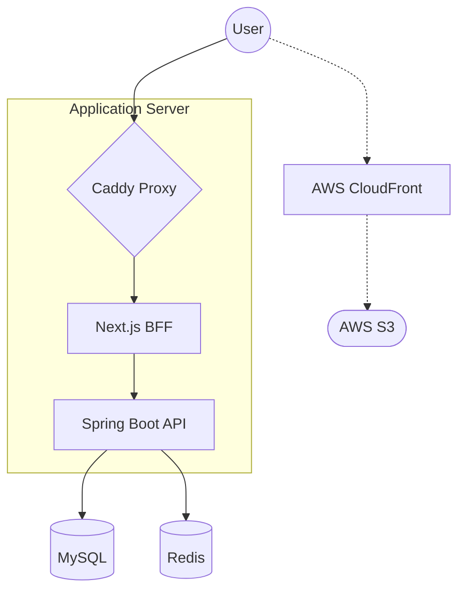

## 💎 DIBS
**개인 프로젝트: 스마트한 거래와 신뢰를 연결하는 고성능 리셀 플랫폼** | [서비스 확인하기](https://imjjh.store)

> 💡 **알림**: 네이버 로그인은 현재 검수 단계로 인해 관리자 계정으로만 이용이 가능합니다. 원활한 테스트를 위해 **카카오 로그인**을 이용해 주세요.

DIBS는 개인 프로젝트로, 사용자가 상품을 안전하고 편리하게 거래할 수 있는 최적의 환경을 제공하기 위해 설계된 고성능 리셀 플랫폼입니다. 

본 프로젝트는 **백엔드 아키텍처 설계, 동시성 제어, 성능 최적화 등 기술적 챌린지 해결에 집중**했습니다. 효율적인 개발을 위해 프론트엔드 및 서브 UI 구현에는 AI 도구를 적극 활용하여 생산성을 높였으며, 이를 통해 대규모 트래픽 상황에서의 시스템 안정성과 데이터 정합성을 확보하는 데 모든 역량을 투입했습니다.

---

## 🚀 Key Highlights
- **분산 환경 최적화**: Redis Distributed Lock을 통한 선착순 재고 차감 및 동시성 제어
- **보안 및 트래픽 제어**: JWT 기반 보안 토큰 관리 및 Bucket4j를 이용한 IP 기반 API 처리율 제한(Rate Limiting)
- **고성능 검색**: QueryDSL을 활용한 동적 필터링 및 프로젝션 최적화
- **클라우드 네이티브**: AWS S3 + CloudFront(OAC)를 통한 보안 미디어 전송 인프라

---

## 🗓️ 개발 기간
- 2025.11.30 ~ 2026.02.09

---

## 🛠 Tech Stack

### Backend
- **Core**: Java 21, Spring Boot 3.4.1
- **Security**: Spring Security, OAuth2 Client, JWT (Access/Refresh Token)
- **Database**: MySQL 8.4, Spring Data JPA, QueryDSL 5.0
- **Caching & Lock**: Redis, Redisson (Distributed Lock & JCache)
- **Traffic Control**: Bucket4j (Rate Limiting)
- **Utilities**: MapStruct (DTO Mapping), Swagger (SpringDoc 2.8.5)
- **Testing**: JUnit 5, Testcontainers (MySQL, Redis)

### Infrastructure & DevOps
- **Cloud**: AWS EC2, AWS S3, AWS CloudFront (OAC), AWS ECR
- **Proxy**: Caddy (Reverse Proxy, SSL)
- **Container**: Docker, Docker Compose

---

## ✨ 핵심 기술 상세

### 1. 트래픽 제어 및 보안 (Traffic Control & Security)
- **[Distributed Rate Limiting]**: `Bucket4j`와 `Redisson`을 연동하여 분산 환경에서도 정확한 **IP 기반 API 처리율 제한** 구현 (1초당 최대 5회 요청 제한)
- **[OAuth2 & JWT]**: 카카오, 네이버 소셜 로그인 연동 및 Access/Refresh Token 패턴 적용 (Refresh Token을 Redis에 저장하여 보안성 향상)
- **[RBAC (Role-Based Access Control)]**: Spring Security를 활용하여 일반 사용자(Buyer)와 판매자(Seller) 권한을 엄격히 분리하고, API 및 도메인 레벨의 접근 제어 구현

### 2. 동시성 제어 및 주문 정합성 (Concurrency & Order Integrity)
- **[Redis Distributed Lock]**: 주문 및 재고 차감 시 발생하는 Race Condition을 `Redisson` 분산락으로 제어하여 데이터 무결성 보장
- **[Atomic Order Process]**: 재고 차감과 주문 생성을 원자적으로 처리하여 초과 판매 방지 및 데이터 정합성 유지
- **[Concurrency Testing]**: 100건 이상의 동동시 주문 시뮬레이션 테스트를 통해 멀티스레드 환경에서의 로직 안정성 검증

### 3. 동적 검색 및 데이터 최적화 (Search & Performance)
- **[Dynamic Filtering]**: `QueryDSL`을 사용하여 키워드, 카테고리, 가격대 등 복잡한 조건에 대응하는 동적 쿼리 엔진 구현
- **[Projection Optimization]**: 필요한 필드만 조회하는 DTO 프로젝션을 통해 DB 부하 및 네트워크 전송 비용 최소화
- **[Content Delivery]**: AWS S3 + CloudFront(OAC) 연동을 통해 원본 보안을 유지하며 효율적인 이미지 에셋 전송 구현

---

## 🏗️ System Architecture

### Information Flow

- **Traffic Flow**: User ➜ **Caddy** ➜ **Next.js (BFF)** ➜ **Spring Boot**
- **Media Delivery**: User ➜ **CloudFront (OAC)** ➜ **S3**

---

## 🛠️ 주요 구현 기능
- **판매자 센터**: 사업자 입점 승인 및 상품 등록/수정/삭제 라이프사이클 관리
- **주문 시스템**: 주문 시 원자적 재고 차감 및 데이터 정합성 보장 프로세스
- **검색 및 상세**: 스마트 필터링 검색 및 상품 상태(품절 등)에 따른 구매 버튼 제어